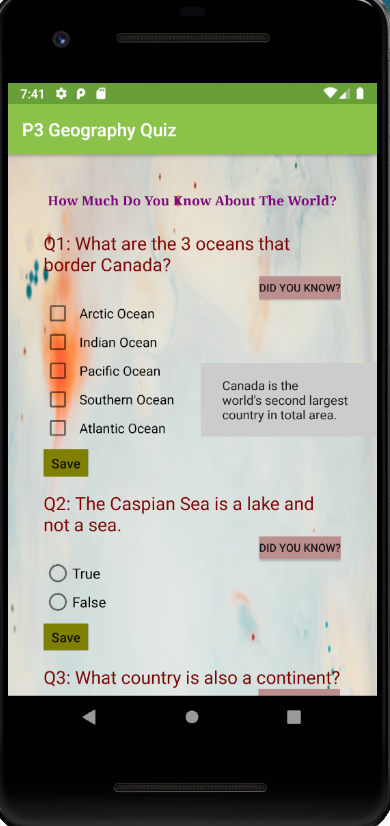
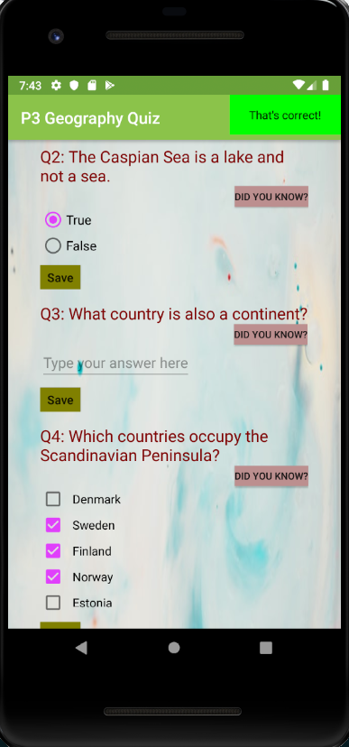
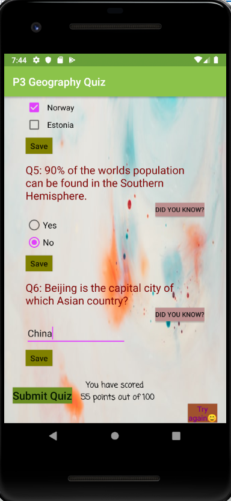

# GeographyQuiz
Quiz App that contains 6 randomly picked questions. 

This project's goal was to create an educational app that quizzes a user about a certain topic and it represents my third project for the Android Basics NanoDegree Program at Udacity.
Each question is evaluated to a certain number of points, maximum final score being 100. It also has a reset button that allows the users to give it another try.

    
